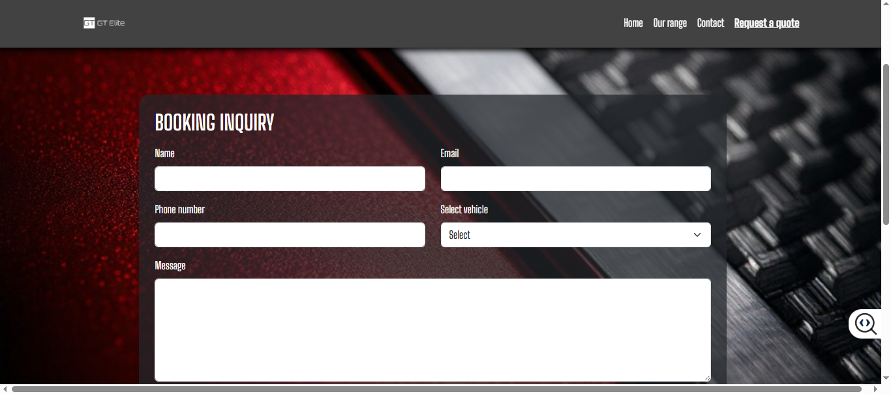
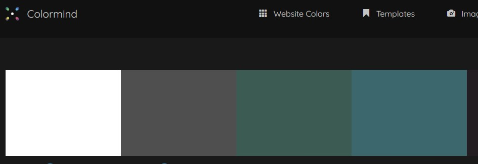
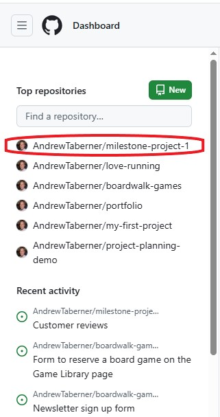
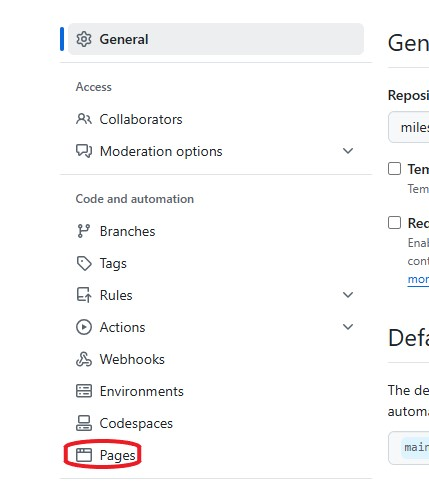
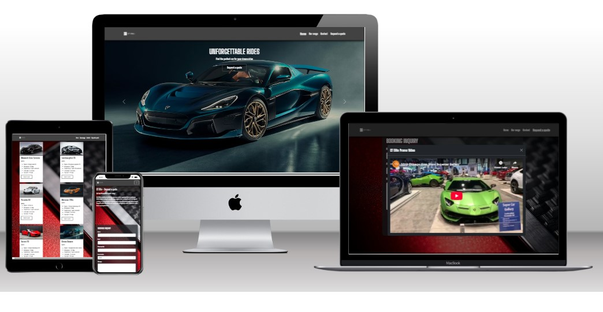

# GT Elite

GT Elite is a fictional Preformance Car hire website offering high performance luxury cars to rent for any event.

---

## Features

1. Navigation bar
2. Our range section
3. contact section
4. Request quote form
5. Success screen

---

## Audience

The website hopes to attract all types of audience, but is mostly targeted at customers who are are planning special event (i.e. Wedding, Prom or Graduation).

---

## Rationale for development

GT Elite was developed to meet a clear, well-defined purpose:

To provide an accessible, attractive, and user-friendly platform for customers looking to hire luxury performance vehicles for special occasions such as weddings, proms, and graduations.

### The key drivers behind the project are:

Many users planning major life events want an easy way to browse and select a prestige vehicle without needing to visit multiple showrooms.

Customers expect professional, visually appealing websites that quickly deliver information like car specifications, prices, and booking processes.

Today's users often access websites via mobile devices, so responsiveness and simple navigation are essential.

### The website directly addresses these needs by:

Providing high-quality visuals and specifications for each car, enabling informed decision-making.

Including a simple quote request form so users can get pricing quickly.

Offering clear contact information and a straightforward layout to make it easy for users to get in touch.

Ensuring responsive design for a seamless experience on both mobile and desktop devices.

The development of GT Elite was guided by user stories, ensuring that each feature aligned with real user expectations.

For example, the navigation bar ensures easy movement across sections, high-resolution images appeal to the luxury market, and the request form simplifies the hiring process for customers.

By focusing on these goals, the project ensures it not only serves a functional purpose but also provides a positive, memorable experience that suits its target audience’s needs.

---

## User Stories

User stories are short, simple descriptions of a feature or requirement from the end user’s perspective. They help teams understand what users need and why. This aid the planning and design process. Here are the user stories for the project.

- As a First-Time Visitor, I need easy navigation and a user-friendly design, including a responsive layout for my device, so I can find information quickly and efficiently without frustration.

- As a visitor, I want to see high-quality images and specifications of the companies available cars for hire, so I can decide on the right type of car for me.

- As a potential customer, I need to find essential information such as location, contact details, and opening hours, so I can easily plan my visit or get in touch the company.

- As a Customer, I want to request a quote using a simple inquiry form, so I can plan this into my budget.

---

## Project Planning

### Project board

The project board is a tool to aid a developer what the minimum elements are needed to be created for the website to be fit for purporse. The user stories are assigned labels for must-have, should-have, could-have (MSC), based on the above goals and project constraints.

The project board can be viewed here:
[project board](https://github.com/users/AndrewTaberner/projects/3)

## Wireframes

The basic wireframes were drawnup. Here is an example:

## Design choices

The overall design was to give a luxury high performance feel. The following design choices were made with this in mind:

### Font

The font chosen was "Big Shoulders". This was chosen to git the pages a mordern, tech, speedy feel.

### Colours

The colour scheme was generated from colormind.io and has colours of white and grey to give a good contrast.

## Testing

Several different methods were employes for testing, These were:

- Features Testing
- Browser Compatability
- Responsiveness
- Code Validation
- Lighthouse
- Accessibility

To view the project and conduct testing VSCode terminal command as shown below was used. Then the link below was followed by using 'ctrl + click'.

### Feature Testing

This tests the functional elements of the site.

|       Feature        |                    Test Description                     |                     Expected Outcome                     |        Actual Outcome         | Result  |
| :------------------: | :-----------------------------------------------------: | :------------------------------------------------------: | :---------------------------: | :-----: |
|         Logo         |                     Click logo icon                     |                   Home page displayed                    | Home page displayed correctly | ✅ Pass |
|    Navigation Bar    | Click links (Home, Our Range, Contact, Request a Quote) |            Navigates to correct section/page             | All links function correctly  | ✅ Pass |
|    Our Range Page    |                  View gallery of cars                   | High-quality images and correct specifications displayed |   All images load correctly   | ✅ Pass |
|     Contact Page     |                View contact information                 |      Correct phone number, email, and address shown      |  Details displayed correctly  | ✅ Pass |
| Request a Quote Form |                 Submit valid form data                  |                Redirects to Success page                 |  Redirect works successfully  | ✅ Pass |
| Request a Quote Form |                   Submit empty fields                   |        Browser blocks submission and shows error         |       Validation works        | ✅ Pass |
| Request a Quote Form |                   Enter invalid email                   |              Browser blocks form submission              |       Validation works        | ✅ Pass |
|  Social Media Links  |              Click social icons in footer               |        Opens correct social media page in new tab        |        All links work         | ✅ Pass |

### Form Validation Testing

Testing was conducted for the quote request form to ensure user input is correctly validated.

|            Test Case             |          Expected Outcome           |           Actual Outcome           | Result  |
| :------------------------------: | :---------------------------------: | :--------------------------------: | :-----: |
|        Submit empty form         | Should show required field warnings | Browser prevented form submission  | ✅ Pass |
|       Submit invalid email       |  Form Should show validation error  | Browser displayed validation error | ✅ Pass |
| Submit complete and correct form |      Redirect to Success page       |      Successfully redirected       | ✅ Pass |

### Browser Compatibility

This tests compatibilty of the project on browsers tha the user will commonly use.

| Browser tested | Tested Elements |      Intended Responsiveness       | Result  |
| :------------: | :-------------: | :--------------------------------: | :-----: |
|     Chrome     |    Full site    | Fully functional, no visual errors | ✅ Pass |
|      Edge      |    Full site    | Fully functional, no visual errors | ✅ Pass |
|    Firefox     |    Full site    | Fully functional, no visual errors | ✅ Pass |

### Responsiveness Testing

The responsiveness of the site was tested on different devices and screen sizes.

|  Device Tested   | Screen Size Tested |           Renders as expected           | Result  |
| :--------------: | :----------------: | :-------------------------------------: | :-----: |
|    iphone 14     |       <600px       | Navigation and layout adapted correctly | ✅ Pass |
|      Tablet      |       768px        | Layout scaled properly, images resized  | ✅ Pass |
| Laptop (1024px)  |       >700px       |     Layout and responsiveness good      | ✅ Pass |
| Desktop (1440px) |    Large screen    |            Layout maintained            | ✅ Pass |

A mock up of this can be viewed [here](./assets/images/mock-up.jpg)

### Code Validation

## W3C CSS Validation

This was carried out to check for errors in the CSS files. The results are shown below.

## Validator

This was carried out the validate the code in each HTML file.
|Validator|Code Tested|Result|
| :------------: | :-----------------: | :---------------------: |
|W3 HTML Validator|index.html|No errors found, for info and a warning only|
 Info message due to format tool Prettier.
|W3 HTML Validator|gallery.html|Errors found, Warning shown|

|W3 HTML Validator|quote.html|No errors found, for info and a warning only(see index.html)|
|W3 HTML Checker|success.html|No errors found for info (due to Prettier)and a warning only(see index.html)|
|W3 CSS Validator| style.css|No errors found|
|

### LightHouse

Performance and accessibilty testing was conducted usin Lighthouse. This is accessed via DevTools. As seen below, no issues were encoutered.

## Summary

All major features and pages were successfully tested across multiple browsers and devices.
Form validations work as intended, navigation is smooth, and the site is fully responsive and accessible.
The project meets high standards for performance, usability, and SEO.
Minor warnings from validators were reviewed and found non-critical.

---

## Deployment

The steps below are used to deploy the project to Github pages.

1.  Login to github.
2.  On the dashboard screen select "AndrewTaberner/milestone-project-1"
    From the top respositaries section.
    
3.  Click on the "settings" icon.
    
4.  In the sidebar on the left click on "Pages"
    
5.  Under Build and Deployment select "Deploy from a branch" from the Source dropdown menu.
    
6.  Under Branch, below the Source dropdown menu, select "main" and "/ root" respectively.
7.  Select Save to confirm

Once confirmed, GitHub will build and deploy the site. After a few minutes a link to the webpage will appear.

You may need to refresh the page to see the link.

The deployed website can be viewed here:

- [View the deployed website](https://andrewtaberner.github.io/milestone-project-1/)

Once deployed, the project was tested using various devices including a laptop and mobile phone. On the desktop, browsers Edge, Chrome and Firefox were used to certify compatibility. DevTools was also used to check responsivness.

## Deployed project

## How to run the project loacally

To Clone the project from GitHub:

1. Navigate to the repository [https://github.com/AndrewTaberner/milestone-project-1]
2. Click the Code button and copy the repository URL.
3. Open your terminal or Git Bash.
4. Change your working directory to where you want the cloned directory to be made.
5. Type git clone then paste in the [repository URL] from step 2.
6. Press Enter.

## Development Life Cycle

### Planning

- Defined the project goal: Create a high-end car hire website targeted at special event customers (weddings, proms, graduations).

- Identified the core features needed: Navigation, Our Range (car gallery), Contact Information, Request a Quote form, and a Success Page.

- Developed user stories to clearly define user needs and help prioritize features.

- Created a project board with Must-Have, Should-Have, and Could-Have (MSC) labels to organize development tasks.

### Design

- Created initial wireframes for all major pages to visualize layout and user flow.

- Selected a modern, luxury-inspired color palette (white, grey) using Colormind.io to match the brand theme.

- Chose the "Big Shoulders" font to give the website a modern, sleek, and high-performance feel.

- Planned a responsive design to ensure usability across devices (desktop, tablet, mobile).

### Development

- Built the website using HTML, CSS, and some Bootstrap components (e.g., navigation bar, cards).

- Implemented the navigation bar to allow easy movement between sections.

- Developed the Our Range gallery using card layouts for consistent display of vehicles.

- Built a Request a Quote form to gather customer inquiries.

- Created a Success page to confirm form submissions.

- Added social media links and icons (using FontAwesome) to enhance customer trust and engagement.

## Testing

### Feature Testing:

- Verified that all buttons, forms, and links worked correctly across all pages.

### Browser Compatibility:

Tested the site on Chrome, Edge, and Firefox browsers to ensure consistent appearance and behavior.

### Responsive Testing:

Checked responsiveness on multiple screen sizes (desktop, tablet, mobile) using DevTools and physical devices.

### Code Validation:

Used the W3C Validator to validate HTML and CSS code.

Addressed errors and warnings (except some minor ones caused by code formatting tools like Prettier).

Accessibility and Performance: Used Lighthouse to test for performance, accessibility, best practices, and SEO.

## Deployment

Deployed the project via GitHub Pages following the necessary GitHub setup (branch settings, Pages settings).

Confirmed successful deployment by checking the live site across different devices and browsers.

### Post-Deployment Testing

Conducted a final round of testing to ensure:

Site remained responsive.

All external links worked.

Forms submitted correctly.

Confirmed that users could interact easily with all the website features without encountering broken functionality.

## Credits

- Thanks to my mentor Lauren-Marie for her patience and support as I built this project.
- Thanks to fellow students on slack.
- Thanks to Tutor Support.
- Code snippets used from getbootstrap.com:

  Navbar used on all pages.
  Card sections used on 'Our Range' page.

  - Font Awesome: For the social media and address icons in the footer.
    Code Institute Boardwalk Games Online Tutorials for use as templates.

- Fonts were sourced from Google Fonts

- Images taken from Auto Trader

- Mock-up created at https://techsini.com/multi-mockup/
